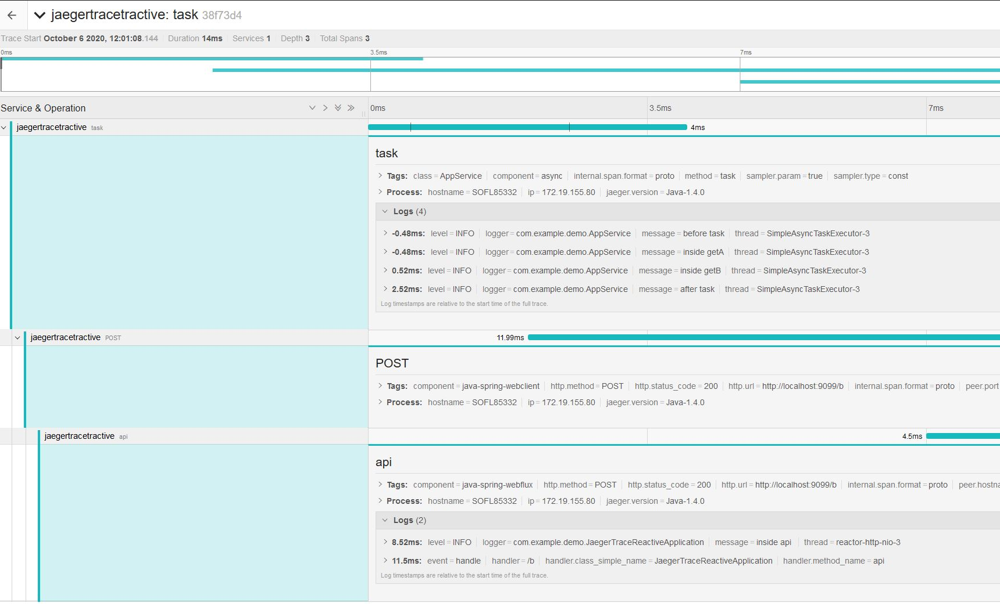
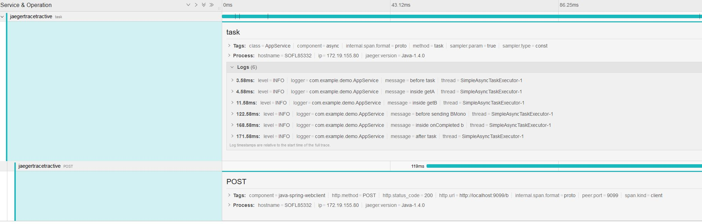

## Demonstrate `no logs in trace` when using webclient

* Step1: Start Jaeger
* Step2: Run application and observe the logs. It will show logs as below
```
[   scheduling-1] c.e.demo.JaegerTraceReactiveApplication  : before task
[   scheduling-1] c.e.demo.JaegerTraceReactiveApplication  : inside getA
[   scheduling-1] c.e.demo.JaegerTraceReactiveApplication  : inside getB
[   scheduling-1] c.e.demo.JaegerTraceReactiveApplication  : after task
[ctor-http-nio-3] c.e.demo.JaegerTraceReactiveApplication  : inside api 
[ctor-http-nio-2] c.e.demo.JaegerTraceReactiveApplication  : before sending BMono
[ctor-http-nio-2] c.e.demo.JaegerTraceReactiveApplication  : inside onCompleted batest
```
* Step3: Navigate to a trace and inspect the logs. Following logs are missing
    * `before sending BMono`
    * `inside onCompleted `
    <p align="center">
      
    </p>

## Optional step.

* StepO1: Open JaegerTraceReactiveApplication.java and inspect the reactive flow
* StepO2: Uncomment lines 42
```
/*.exchangeFunction(clientRequest -> Mono.just(dummyResponseToAvoidPost()))*/
```
* Step)3: Restart application
* StepO4: Navigate to a trace in Jaeger and inspect the logs. All logs are shown
    <p align="center">
      
    </p>


### Analysis

Jaeger tracing does not capture logs after webclient makes http call
